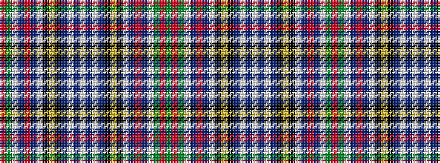

GRGWBRBWKYKBWBWBWBKYKWBRBWGR

It is a 28 stripe tartan.

<figure class="pat-woven">

<figcaption>idealised sample</figcaption>
</figure>

## Colour Sequence



## Tartans with this colour sequence

| Tartans |
|---------------|
| [Wilson's No.117](/setts/s28/r4g4w2t12r5t12w2k5ly2k5t4w2dp5w4dp5w2t4k5ly2k5w2t12r5t12w2g4r4g4~x2/)|
||
