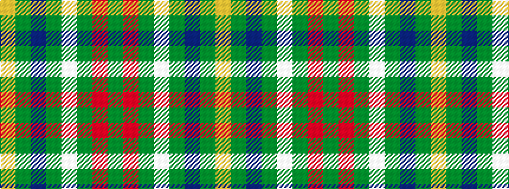

GRGWGBGY

It is a 8 stripe tartan.

<figure class="pat-woven">

<figcaption>idealised sample</figcaption>
</figure>

## Colour Sequence



## Tartans with this colour sequence

| Tartans |
|---------------|
| [St Patrick's Krewe](/variants/s8/dg50r5dg8w10dg8db8dg8lo21~x2/)|
||
