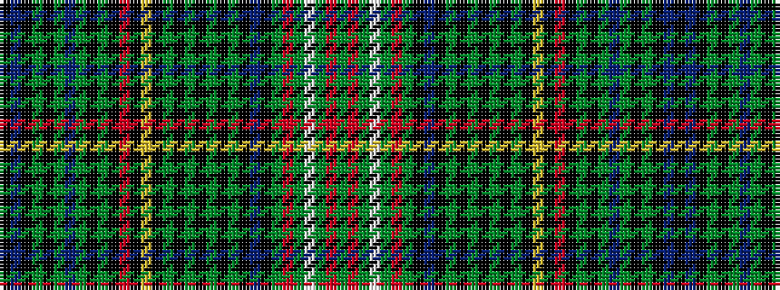

GRGWGRGKBKGKGKGKGKYKRKGKGBGKGKBK

It is a 32 stripe tartan.

<figure class="pat-woven">

<figcaption>idealised sample</figcaption>
</figure>

## Colour Sequence



## Tartans with this colour sequence

| Tartans |
|---------------|
| [Franconian](/setts/s32/k23db5k5g5k5g25dbi5g5k5g5k23r5k5ly5k23g5k5g5k5g25k5g5k5db5k23g7r5g5w5g5r5g7~x2/)|
||
