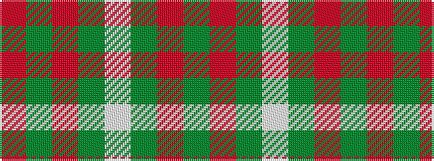

GRGWGRGR

It is a 8 stripe tartan.

<figure class="pat-woven">

<figcaption>idealised sample</figcaption>
</figure>

## Colour Sequence



## Tartans with this colour sequence

| Tartans |
|---------------|
| [Welsh Assembly (Fashion)](/setts/s8/g5o9g4w5g30r2g4r2~x2/)|
||
| [Welsh National](/setts/s8/r8g3r4g44w4~x2/)|
||
