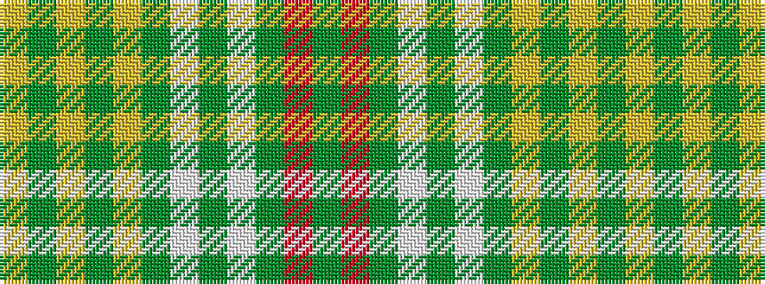

GRGWGWGYGYGY

It is a 12 stripe tartan.

<figure class="pat-woven">

<figcaption>idealised sample</figcaption>
</figure>

## Colour Sequence



## Tartans with this colour sequence

| Tartans |
|---------------|
| [O'Brien](/variants/s12/lo13g6ly2g3ly2g6lb3g2lb3g12r3g6~x2/)|
||
