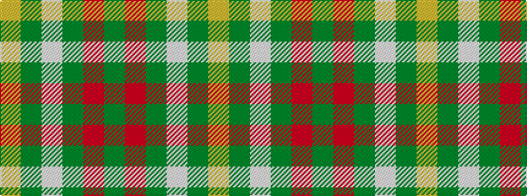

GRGWGY

It is a 6 stripe tartan.

<figure class="pat-woven">

<figcaption>idealised sample</figcaption>
</figure>

## Colour Sequence



## Tartans with this colour sequence

| Tartans |
|---------------|
| [Reid (1939)](/variants/s6/y40r8y4w2y4ly5~x2/)|
||
