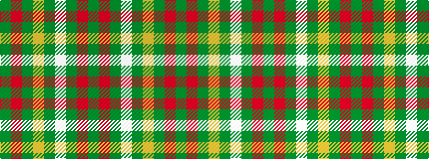

GRGWGYGRG

It is a 9 stripe tartan.

<figure class="pat-woven">

<figcaption>idealised sample</figcaption>
</figure>

## Colour Sequence



## Tartans with this colour sequence

| Tartans |
|---------------|
| [Norwich No.077](/variants/s9/dg5r9dg10w2dg2ly2dg10r9dg5~x2/)|
||
| [Unidentified #33](/variants/s9/dg2r3dg4w1dg1ly1dg4r3dg2~x2/)|
||
| [Unnamed 7](/variants/s9/g2r3g4w1g1ly1g4r3g2~x2/)|
||
| [Wilson's, No 169](/variants/s9/g5r9g10w2g2ly2g10r9g5~x2/)|
||
