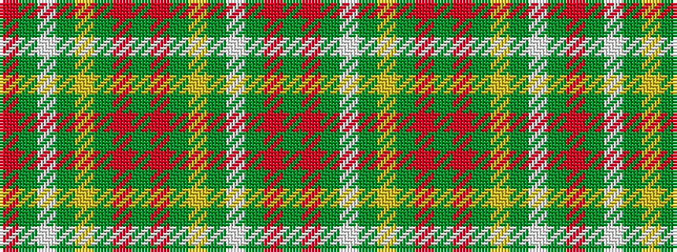

GRGWGYGRGRGYGWGR

It is a 16 stripe tartan.

<figure class="pat-woven">

<figcaption>idealised sample</figcaption>
</figure>

## Colour Sequence



## Tartans with this colour sequence

| Tartans |
|---------------|
| [Wilson's No.169](/setts/s16/r9g10w2g2ly2g10r9g5r9g10ly2g2w2g10r9g5~x2/)|
||
