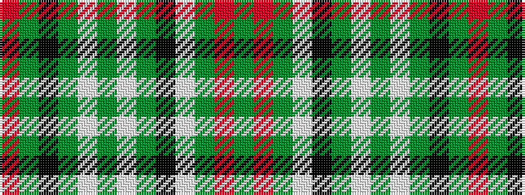

GRGWKGWGWGKGR

It is a 13 stripe tartan.

<figure class="pat-woven">

<figcaption>idealised sample</figcaption>
</figure>

## Colour Sequence



## Tartans with this colour sequence

| Tartans |
|---------------|
| [Balmoral](/setts/s13/y2r1y8lp2k2y1lp1y1lp4y2k1y1r1~x2/)|
||
