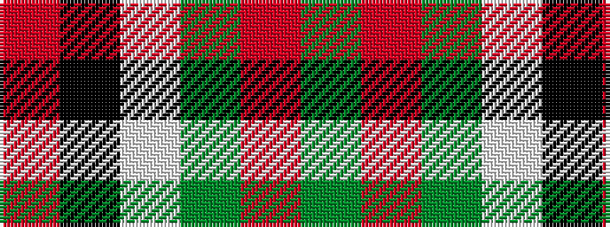

GRGWKR

It is a 6 stripe tartan.

<figure class="pat-woven">

<figcaption>idealised sample</figcaption>
</figure>

## Colour Sequence



## Tartans with this colour sequence

| Tartans |
|---------------|
| [Greig (Personal)](/setts/s6/r60k2w3dg20r10dg20~x2/)|
||
