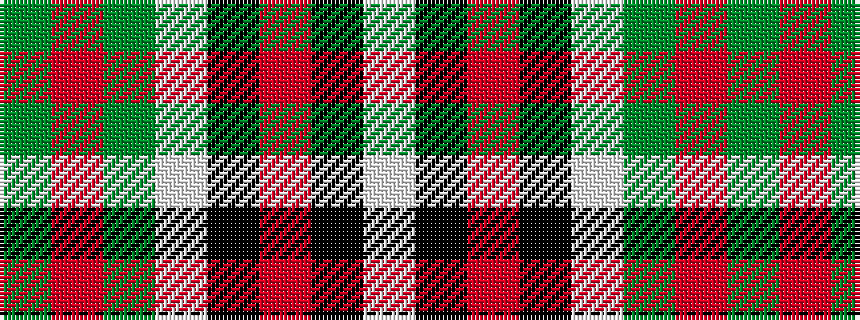

GRGWKRKW

It is a 8 stripe tartan.

<figure class="pat-woven">

<figcaption>idealised sample</figcaption>
</figure>

## Colour Sequence



## Tartans with this colour sequence

| Tartans |
|---------------|
| [Unnamed (Hip Flask)](/setts/s8/dg14o5dg14w5k2o5k2w9~x4/)|
||
