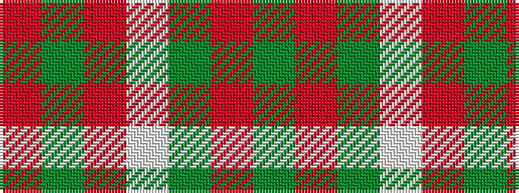

GRGWRGR

It is a 7 stripe tartan.

<figure class="pat-woven">

<figcaption>idealised sample</figcaption>
</figure>

## Colour Sequence



## Tartans with this colour sequence

| Tartans |
|---------------|
| [Crossnor School](/variants/s7/dg4r2dg13lb2r13dg2r4~x2/)|
||
