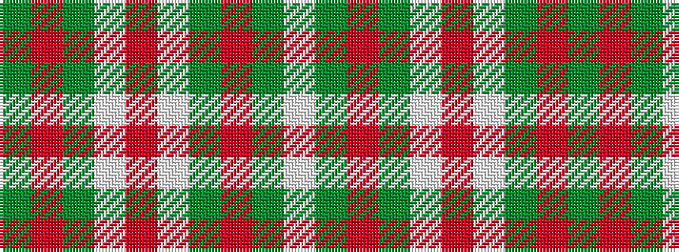

GRGWRWGRGW

It is a 10 stripe tartan.

<figure class="pat-woven">

<figcaption>idealised sample</figcaption>
</figure>

## Colour Sequence



## Tartans with this colour sequence

| Tartans |
|---------------|
| [Wilson's No.005](/setts/s10/dg5r4dg17lt5r32lt5dg17r4dg5w2~x2/)|
||
