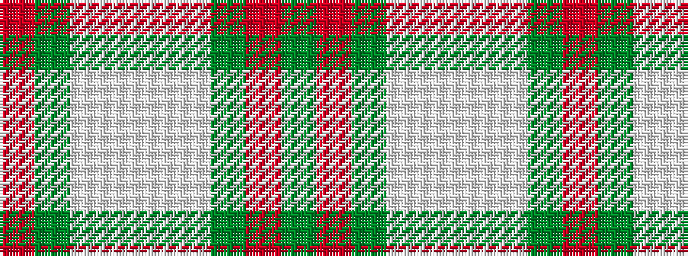

GRGWWWWGR

It is a 9 stripe tartan.

<figure class="pat-woven">

<figcaption>idealised sample</figcaption>
</figure>

## Colour Sequence



## Tartans with this colour sequence

| Tartans |
|---------------|
| [Mounth The.. Corporate Tartan](/variants/s9/dg2o13dg12w3lb10w3lb12g13r2~x2/)|
||
