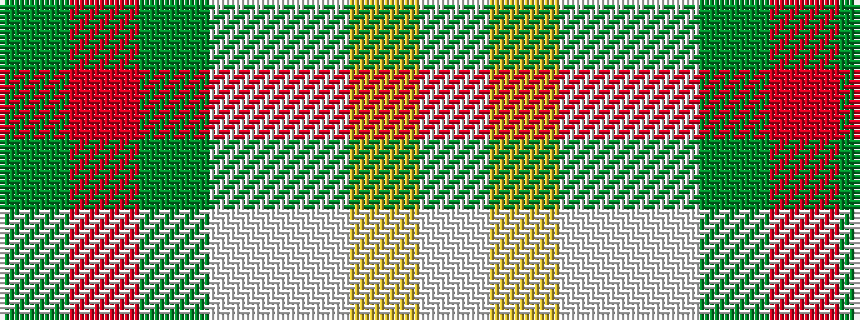

GRGWWYW

It is a 7 stripe tartan.

<figure class="pat-woven">

<figcaption>idealised sample</figcaption>
</figure>

## Colour Sequence



## Tartans with this colour sequence

| Tartans |
|---------------|
| [Postcode Lottery](/variants/s7/g3r1g12w4lb15ly1lb3~x4/)|
||
