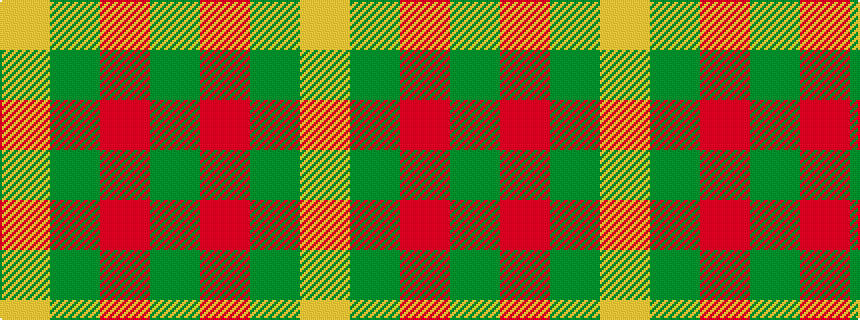

GRGY

It is a 4 stripe tartan.

<figure class="pat-woven">

<figcaption>idealised sample</figcaption>
</figure>

## Colour Sequence



## Tartans with this colour sequence

| Tartans |
|---------------|
| [Barber Family 2011 (Personal)](/variants/s4/ly30dy30r1y16~x2/)|
||
| [O'Neill, Red (Corporate?)](/variants/s4/g9o20g46lg5~x2/)|
||
