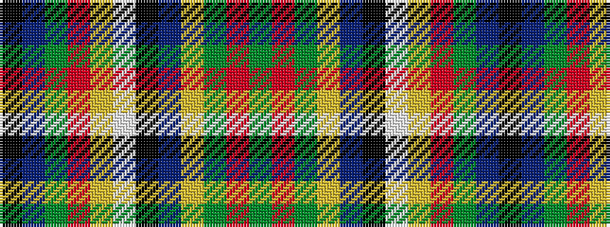

GRGYBKWYRGBK

It is a 12 stripe tartan.

<figure class="pat-woven">

<figcaption>idealised sample</figcaption>
</figure>

## Colour Sequence



## Tartans with this colour sequence

| Tartans |
|---------------|
| [Lethbridge, City of](/variants/s12/g20ri1g10ly2t3k1w2ly10r1g10t2k1~x2/)|
||
