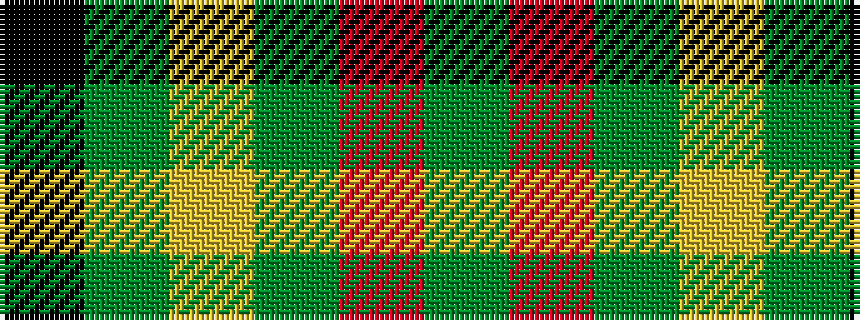

GRGYGK

It is a 6 stripe tartan.

<figure class="pat-woven">

<figcaption>idealised sample</figcaption>
</figure>

## Colour Sequence



## Tartans with this colour sequence

| Tartans |
|---------------|
| [Cates Armigers (Personal)](/variants/s6/dg20r8dg20ly8g20k5~x2/)|
||
