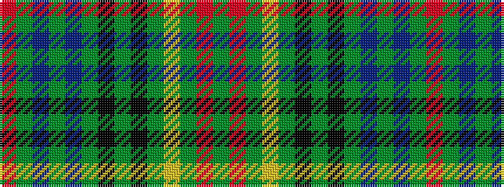

GRGYGKGKGBGBGR

It is a 14 stripe tartan.

<figure class="pat-woven">

<figcaption>idealised sample</figcaption>
</figure>

## Colour Sequence



## Tartans with this colour sequence

| Tartans |
|---------------|
| [Eildon (1996)](/setts/s14/o19dg2db8dg4db8dg2k19dg2k2dg11ly2dg11o1dg2~x2/)|
||
