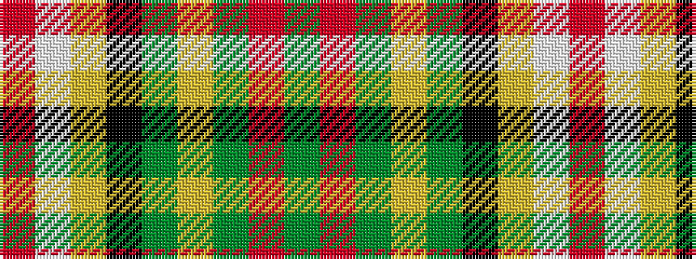

GRGYGKYWR

It is a 9 stripe tartan.

<figure class="pat-woven">

<figcaption>idealised sample</figcaption>
</figure>

## Colour Sequence



## Tartans with this colour sequence

| Tartans |
|---------------|
| [Cates Hunting](/setts/s9/dg23r7dgi25ly5dg17k5ly1w1r1~x2/)|
||
| [Cates Hunting (Clan)](/setts/s9/dg23r7g25ly5dg17k5ly1w1r1~x2/)|
||
