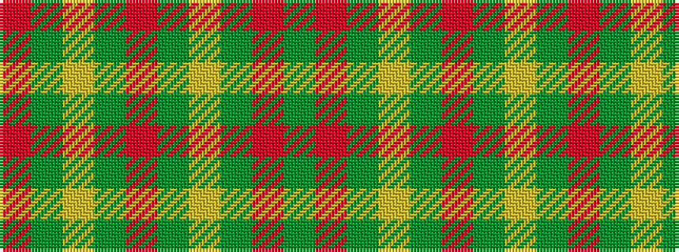

GRGYGRGYGR

It is a 10 stripe tartan.

<figure class="pat-woven">

<figcaption>idealised sample</figcaption>
</figure>

## Colour Sequence



## Tartans with this colour sequence

| Tartans |
|---------------|
| [Buccleuch Dress (Fashion)](/variants/s10/g5r2g2lr34g18r4g4lr4g4r4~x2/)|
||
