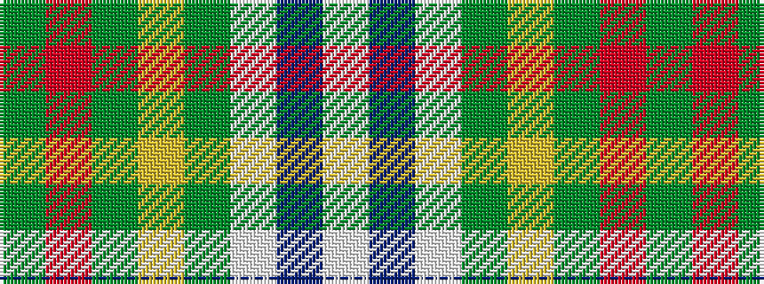

GRGYGWBW

It is a 8 stripe tartan.

<figure class="pat-woven">

<figcaption>idealised sample</figcaption>
</figure>

## Colour Sequence



## Tartans with this colour sequence

| Tartans |
|---------------|
| [Green Mountain](/variants/s8/dg26r2dg3ly2dg8w20db3w4~x2/)|
||
