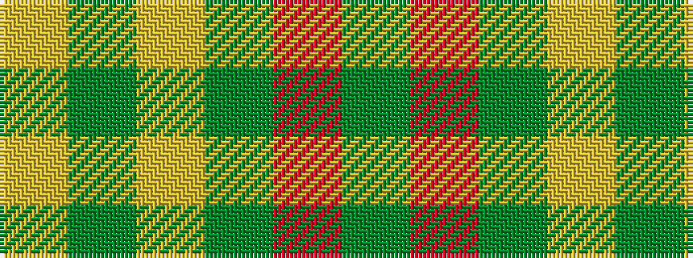

GRGYGY

It is a 6 stripe tartan.

<figure class="pat-woven">

<figcaption>idealised sample</figcaption>
</figure>

## Colour Sequence



## Tartans with this colour sequence

| Tartans |
|---------------|
| [MacMillan/Isetan](/setts/s6/g68r24g8lo18g3lo18~x2/)|
||
| [MacMillan/Isetan (Corporate)](/setts/s6/dg68r24dg8lo18dg3lo18~x2/)|
||
