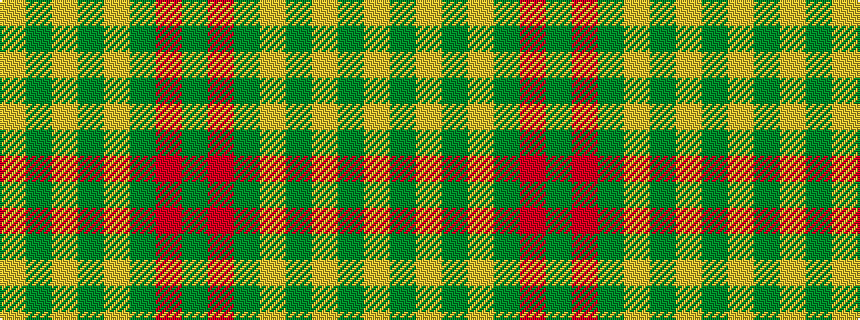

GRGYGYGY

It is a 8 stripe tartan.

<figure class="pat-woven">

<figcaption>idealised sample</figcaption>
</figure>

## Colour Sequence



## Tartans with this colour sequence

| Tartans |
|---------------|
| [St. Christopher (Corporate)](/variants/s8/dg5r3dg3lo2dg1ly8dg24lo2~x2/)|
||
