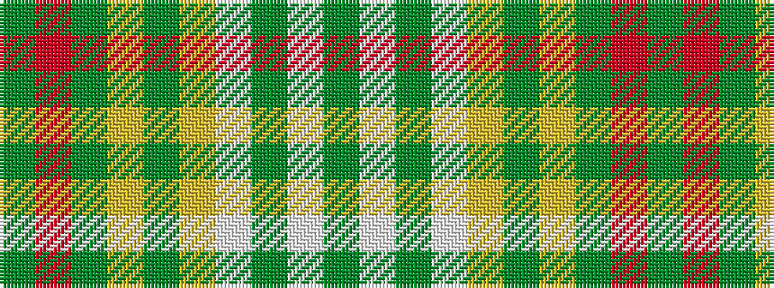

GRGYGYWGWG

It is a 10 stripe tartan.

<figure class="pat-woven">

<figcaption>idealised sample</figcaption>
</figure>

## Colour Sequence



## Tartans with this colour sequence

| Tartans |
|---------------|
| [Michigan, State of](/setts/s10/g18w1g4w1ly4dg1ly2dg12r2dg4~x2/)|
||
| [Michigan, State of (District)](/setts/s10/gi18w1gi4w1lo4g1lo2g12r2g4~x2/)|
||
