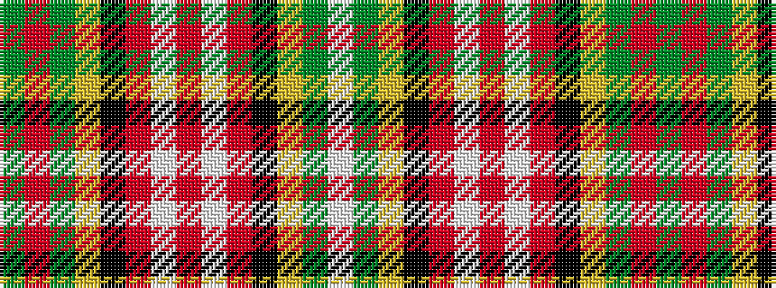

GRGYKRWRWRKYGW

It is a 14 stripe tartan.

<figure class="pat-woven">

<figcaption>idealised sample</figcaption>
</figure>

## Colour Sequence



## Tartans with this colour sequence

| Tartans |
|---------------|
| [Ogilvie (D.C. Stewart)](/setts/s14/y4r1y4ly1k1r6w1r4w1r6k1ly1y4w1~x8/)|
||
