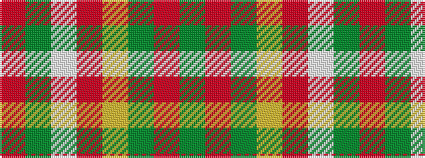

GRGYRWGR

It is a 8 stripe tartan.

<figure class="pat-woven">

<figcaption>idealised sample</figcaption>
</figure>

## Colour Sequence



## Tartans with this colour sequence

| Tartans |
|---------------|
| [Aviemore, Check](/variants/s8/g2o10g11ly4o1w18g2o1~x2/)|
||
| [Dogwood Trade Tartan](/variants/s8/g3r12g12lo5r1w25g2r1~x2/)|
||
