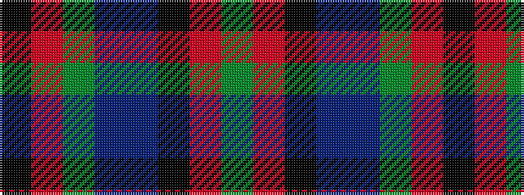

GRKBBGRK

It is a 8 stripe tartan.

<figure class="pat-woven">

<figcaption>idealised sample</figcaption>
</figure>

## Colour Sequence



## Tartans with this colour sequence

| Tartans |
|---------------|
| [Stansbury](/setts/s8/dg28r3k28db8t1dg8r2k3~x2/)|
||
| [Stansbury (2014)](/setts/s8/dg28r3k28dt8t1dg8r2k3~x2/)|
||
