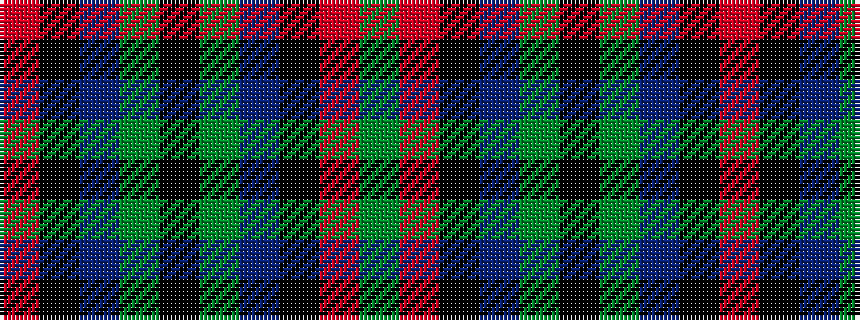

GRKBGKGBKR

It is a 10 stripe tartan.

<figure class="pat-woven">

<figcaption>idealised sample</figcaption>
</figure>

## Colour Sequence



## Tartans with this colour sequence

| Tartans |
|---------------|
| [Walker James](/setts/s10/r4k6t1g7k2g7t1k6r4g2~x4/)|
||
