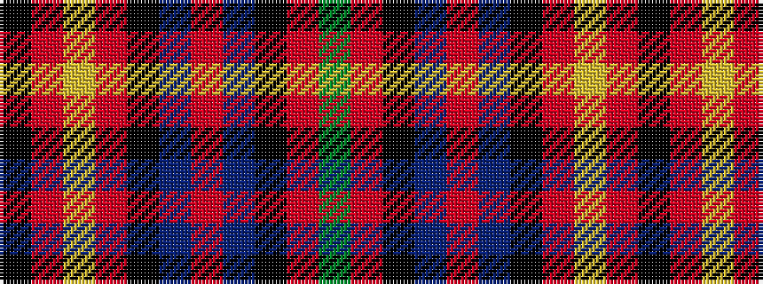

GRKBRBKRYRK

It is a 11 stripe tartan.

<figure class="pat-woven">

<figcaption>idealised sample</figcaption>
</figure>

## Colour Sequence



## Tartans with this colour sequence

| Tartans |
|---------------|
| [Faulkner (Personal)](/variants/s11/g10o1k3dp22o1dp8k2r26lo1r6k3~x2/)|
||
