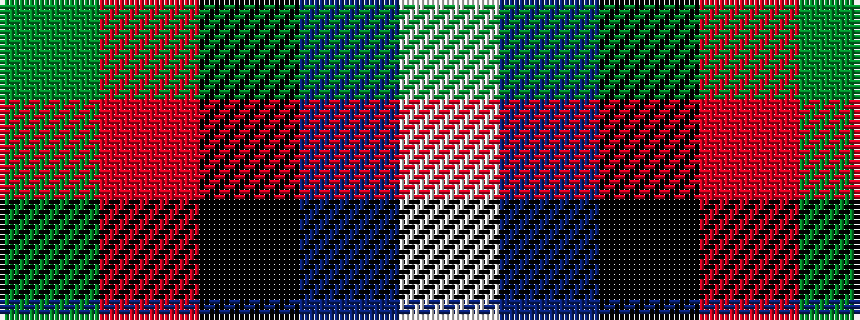

GRKBW

It is a 5 stripe tartan.

<figure class="pat-woven">

<figcaption>idealised sample</figcaption>
</figure>

## Colour Sequence



## Tartans with this colour sequence

| Tartans |
|---------------|
| [Baillie of Polkemett](/setts/s5/w3db12k12r20g2~x2/)|
||
| [Baillie of Polkemmet Red](/setts/s5/w3b12k12r20g2~x2/)|
||
| [Diaspora (Fashion)](/setts/s5/lb3db28k12r22dg1~x2/)|
||
