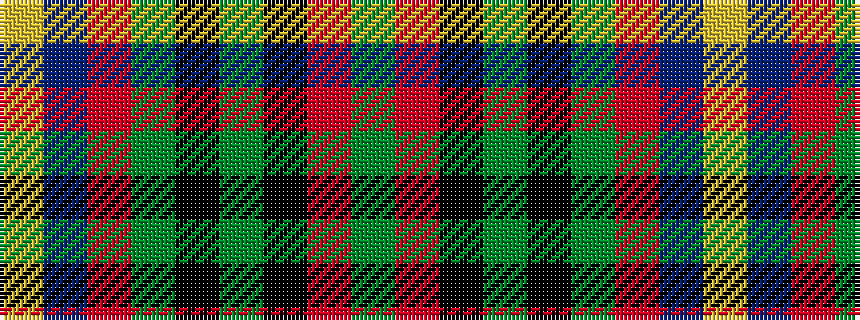

GRKGKGRBY

It is a 9 stripe tartan.

<figure class="pat-woven">

<figcaption>idealised sample</figcaption>
</figure>

## Colour Sequence



## Tartans with this colour sequence

| Tartans |
|---------------|
| [Stirling University](/variants/s9/dgi28r4k3y2k1dg2r3db20ly2~x2/)|
||
| [Stirling, University](/variants/s9/g28r4k3y2k1dg2r3db20ly2~x2/)|
||
