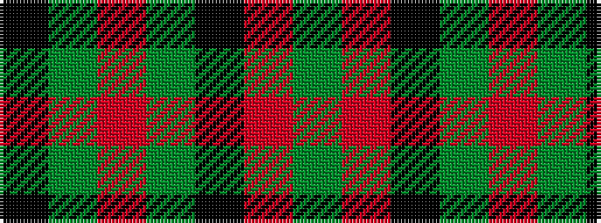

GRKGRGK

It is a 7 stripe tartan.

<figure class="pat-woven">

<figcaption>idealised sample</figcaption>
</figure>

## Colour Sequence



## Tartans with this colour sequence

| Tartans |
|---------------|
| [Cadence Design Systems (Corporate)](/setts/s7/k51g5r15g37k17r6g7~x2/)|
||
