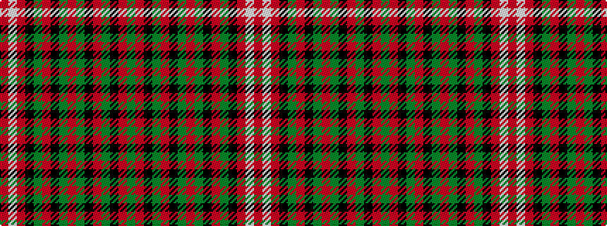

GRKGRKGRGKRGKRWR

It is a 16 stripe tartan.

<figure class="pat-woven">

<figcaption>idealised sample</figcaption>
</figure>

## Colour Sequence



## Tartans with this colour sequence

| Tartans |
|---------------|
| [Gudbrandsdalen, Mannsdrakt](/variants/s16/dg44r2k5dg4r2k1dg2r10dg2k1r2dg4k5r2w1r44~x2/)|
||
