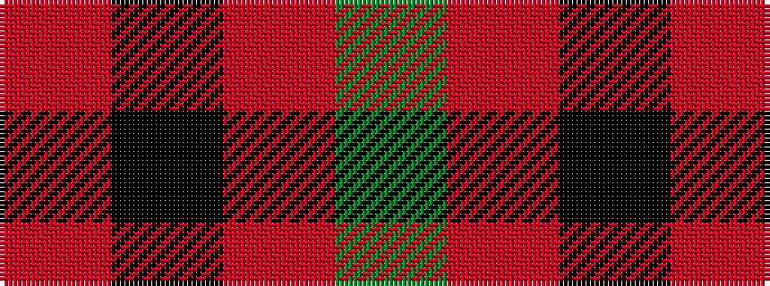

GRKR

It is a 4 stripe tartan.

<figure class="pat-woven">

<figcaption>idealised sample</figcaption>
</figure>

## Colour Sequence



## Tartans with this colour sequence

| Tartans |
|---------------|
| [Royal Guard of Oman 4th Band Squadron](/setts/s4/g38r24k9r9~x2/)|
||
