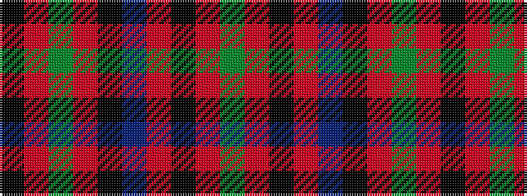

GRKRBKRGRK

It is a 10 stripe tartan.

<figure class="pat-woven">

<figcaption>idealised sample</figcaption>
</figure>

## Colour Sequence



## Tartans with this colour sequence

| Tartans |
|---------------|
| [MacKillop](/variants/s10/g4r4k2r20t1k7r2g10r3k2~x2/)|
||
| [MacKillop (Scottish Tartan Society)](/variants/s10/dg4r2k2r20t1k7r2dg10r3k2~x2/)|
||
