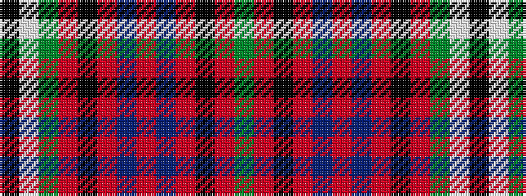

GRKRBRBRKRGWK

It is a 13 stripe tartan.

<figure class="pat-woven">

<figcaption>idealised sample</figcaption>
</figure>

## Colour Sequence



## Tartans with this colour sequence

| Tartans |
|---------------|
| [Maguire](/setts/s13/g18r18k3r3db3r3db4r3k9r4g18w6k3~x2/)|
||
