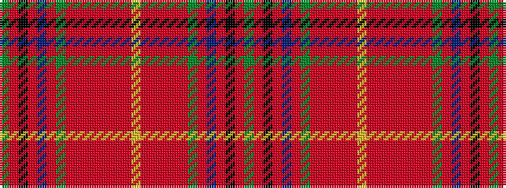

GRKRBRGRRRRRRRYRRRRRGRBRKRG

It is a 27 stripe tartan.

<figure class="pat-woven">

<figcaption>idealised sample</figcaption>
</figure>

## Colour Sequence



## Tartans with this colour sequence

| Tartans |
|---------------|
| [MacKay of Strathnaver](/setts/s27/g18r1k18r1n18r1y18r1oii18r1oi18r1o18r1lr18r1oi18r1oii18r1y18r1n18r1k18r1g18~x2/)|
||
