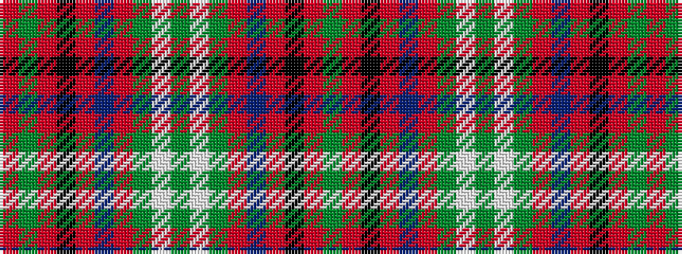

GRKRBRGWGWGRBRKRGR

It is a 18 stripe tartan.

<figure class="pat-woven">

<figcaption>idealised sample</figcaption>
</figure>

## Colour Sequence



## Tartans with this colour sequence

| Tartans |
|---------------|
| [Seton](/setts/s18/g3w1g6r2dp2r1k2r10g1r2~x8/)|
||
