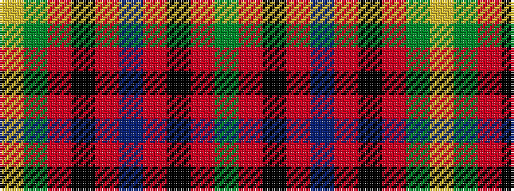

GRKRBRKRGY

It is a 10 stripe tartan.

<figure class="pat-woven">

<figcaption>idealised sample</figcaption>
</figure>

## Colour Sequence



## Tartans with this colour sequence

| Tartans |
|---------------|
| [Royal College of Physicians Corporate Tartan](/variants/s10/g23r3k9r3db18r3k9r3g23ly3~x2/)|
||
