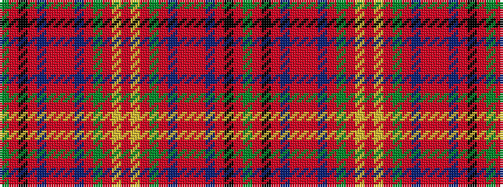

GRKRBRRRBRGRYRYRGRBRRRBRKRG

It is a 27 stripe tartan.

<figure class="pat-woven">

<figcaption>idealised sample</figcaption>
</figure>

## Colour Sequence



## Tartans with this colour sequence

| Tartans |
|---------------|
| [MacKay of Strathnaver](/setts/s27/dg18r1k18r1n18r1o18r1dr18r1dy18r1lo18r1ly18r1dy18r1dr18r1o18r1n18r1k18r1dg18~x2/)|
||
| [MacKay of Strathnaver Clan Tartan Tartan Number: 2037. Earliest known date: 1952 Designed circa 1952 for Wm Andersons of Edinburgh and Lord Reay. The tartan features the seasons of the year. See products available Copyright © Blair Urquhart, Comrie, 2015](/setts/s27/g18r1k18r1n18r1o18r1dr18r1dy18r1lo18r1ly18r1dy18r1dr18r1o18r1n18r1k18r1g18~x2/)|
||
