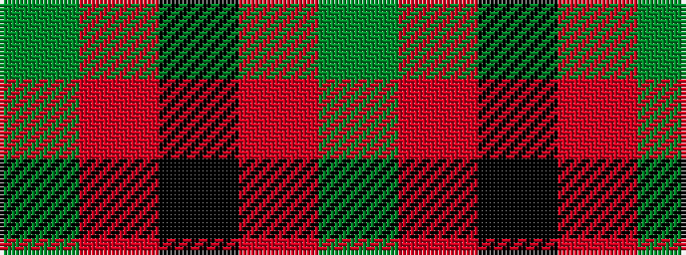

GRKRG

It is a 5 stripe tartan.

<figure class="pat-woven">

<figcaption>idealised sample</figcaption>
</figure>

## Colour Sequence



## Tartans with this colour sequence

| Tartans |
|---------------|
| [MacNab, Ancient](/variants/s5/dg62r7k4r4dg62~x2/)|
||
| [Timespan, (MacKay)](/variants/s5/y6r1k6r1g6~x6/)|
||
