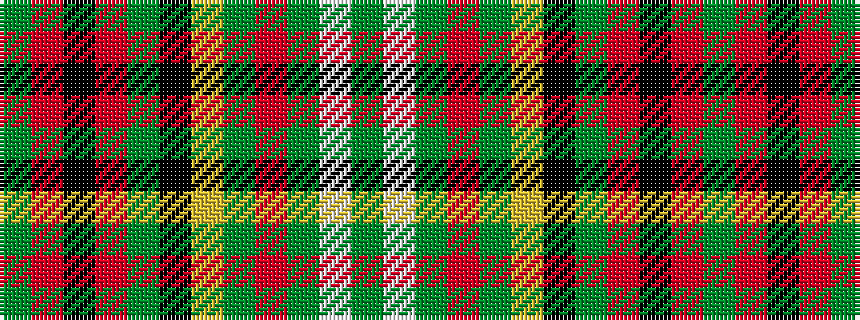

GRKRGKYGRGWG

It is a 12 stripe tartan.

<figure class="pat-woven">

<figcaption>idealised sample</figcaption>
</figure>

## Colour Sequence



## Tartans with this colour sequence

| Tartans |
|---------------|
| [Royal Army of Oman](/setts/s12/dg6w3dg15r3dg15ly3k10dg21r3k3r3dg3~x2/)|
||
