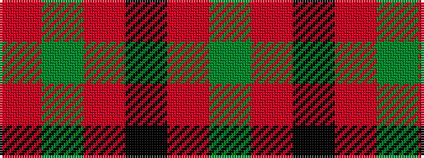

GRKRGR

It is a 6 stripe tartan.

<figure class="pat-woven">

<figcaption>idealised sample</figcaption>
</figure>

## Colour Sequence



## Tartans with this colour sequence

| Tartans |
|---------------|
| [Waverley Care Aids Trust (Corporate)](/variants/s6/r8g2r2k1r1g2~x10/)|
||
