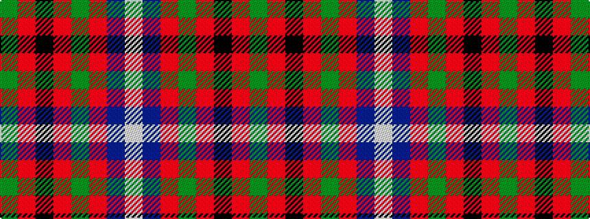

GRKRGRBW

It is a 8 stripe tartan.

<figure class="pat-woven">

<figcaption>idealised sample</figcaption>
</figure>

## Colour Sequence



## Tartans with this colour sequence

| Tartans |
|---------------|
| [MacQueen of Dalmagarry (Clan?)](/variants/s8/g3r4k1r26y14r4dp16w2~x2/)|
||
