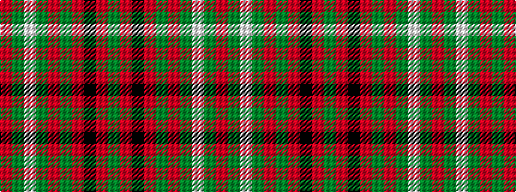

GRKRGRGWGR

It is a 10 stripe tartan.

<figure class="pat-woven">

<figcaption>idealised sample</figcaption>
</figure>

## Colour Sequence



## Tartans with this colour sequence

| Tartans |
|---------------|
| [Scott](/variants/s10/dg4r3k1r28dg14r4dg4lb3dg4r4~x2/)|
||
| [Scott - 1842 (Clan)](/variants/s10/r4g4w3g4r4g14r28k1r3g4~x2/)|
||
| [Scott Red Clan Tartan](/variants/s10/r4g4w3g4r4g14r28k2r2g3~x2/)|
||
