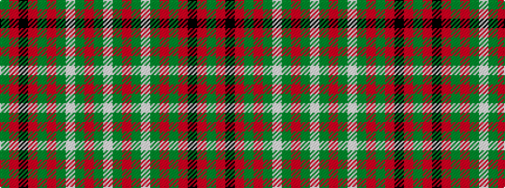

GRKRGRGWGRGW

It is a 12 stripe tartan.

<figure class="pat-woven">

<figcaption>idealised sample</figcaption>
</figure>

## Colour Sequence



## Tartans with this colour sequence

| Tartans |
|---------------|
| [Scott](/variants/s12/g4r3k1r28g14r4g4w3g4r4g4w3~x2/)|
||
