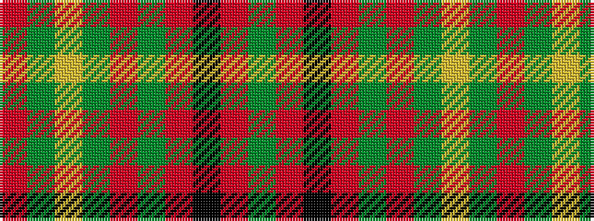

GRKRGRGYGR

It is a 10 stripe tartan.

<figure class="pat-woven">

<figcaption>idealised sample</figcaption>
</figure>

## Colour Sequence



## Tartans with this colour sequence

| Tartans |
|---------------|
| [Scott](/setts/s10/dg4r3k1r28dg14r4dg4lr3dg4r4~x2/)|
||
