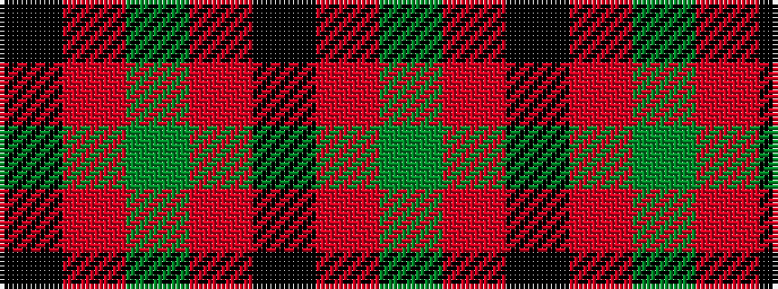

GRKRGRK

It is a 7 stripe tartan.

<figure class="pat-woven">

<figcaption>idealised sample</figcaption>
</figure>

## Colour Sequence



## Tartans with this colour sequence

| Tartans |
|---------------|
| [Glasgow, City of District Tartan Tartan Number: 515. Earliest known date: 1819 Also known as 'Madder'. Marroon red is used in this illustration to convey what Wilson describes as madder. This colour, produced from plant dyes, is a dull shade of red. Rock and Wheel refers to an old form of manufacture. Worn by the City of Glasgow pp See products available Copyright © Blair Urquhart, Comrie, 2015](/setts/s7/dg28r4k25r22dg27r4k2~x2/)|
||
