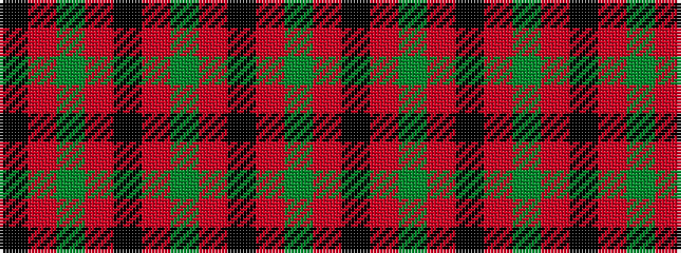

GRKRGRKRGRK

It is a 11 stripe tartan.

<figure class="pat-woven">

<figcaption>idealised sample</figcaption>
</figure>

## Colour Sequence



## Tartans with this colour sequence

| Tartans |
|---------------|
| [Unnamed C19th - Portrait by Ansdell](/variants/s11/dg22r3k10r3dg24r2k4r2dg24r2k4~x2/)|
||
